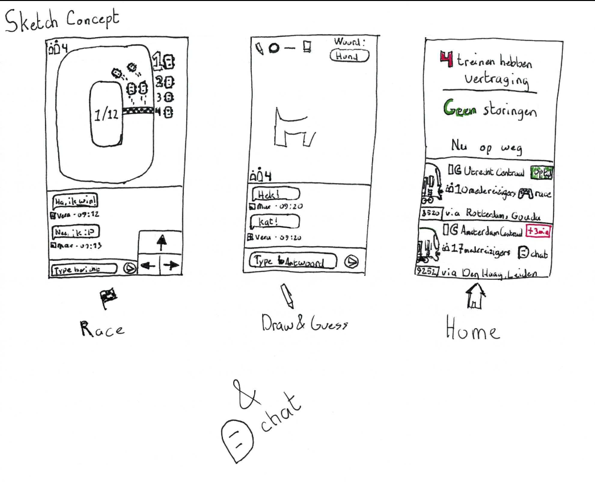

# Zugo

Chat & play mini-games with others travelling by train.

## Concept

Chat and play mini-games with others who are also taking the same train. Select the train you're taking and chat or play mini-games together. Get live information about delays and disruptions.



## Dependencies

* Express
* Socket.io

For other dependencies see [**`package.json`**](package.json)

## Installation

1. Clone the repository and navigate to the directory.

2. **Install dependencies:**

	```bash
	npm install
	```

### Run application

```bash
# To run the server
npm run start

# To run the development environment
npm run dev
```

## Functionalities

* Chat with others
* Play mini-games
* Get live train information

## NS API

For travel information about current trains I use the [**NS API**](https://www.ns.nl/en/travel-information/ns-api).

## Data Life Cycle Diagram

A *Data Life Cycle Diagram* shows how data flows through an application. The following graph shows how the data is transferred from the API and the server to the user:

## License

[**GNU General Public License v3.0**](LICENSE)