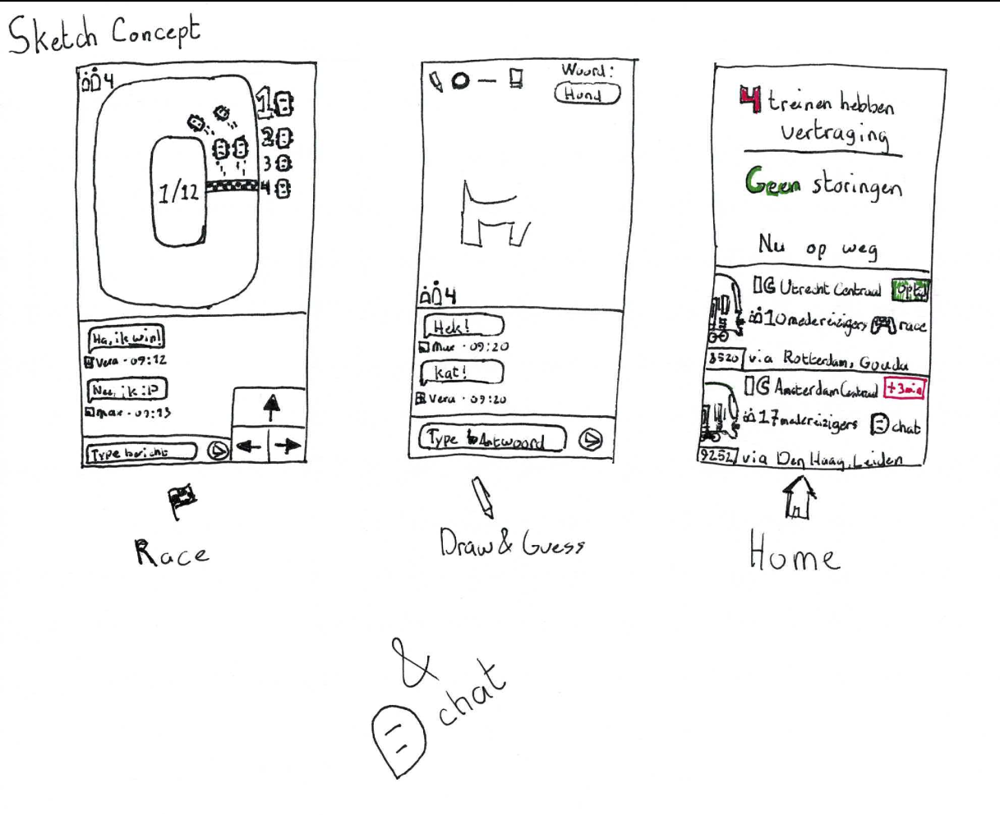
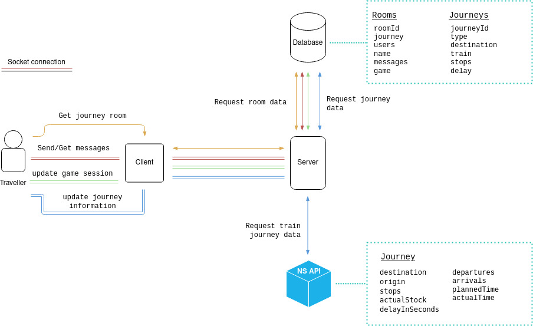

# Zugo

Chat & play mini-games with others travelling by train.

[**Go to demo >**](https://zu-go.herokuapp.com/)

## Concept

Chat and play mini-games with others who are also taking the same train. Select the train you're taking and chat or play mini-games together. Get live information about delays and disruptions.



## Dependencies

* Vue.js
* Express
* Socket.io

For dependencies on the server see [**`package.json`**](server/package.json)  (server) and for the client see [**`package.json`**](client/package.json) (client).

## Installation

1. Clone the repository and navigate to the directories.

2. **Install dependencies:**

	```bash
	npm install
	```

### Run server

```bash
# To run the server
npm run start

# To run the development environment
npm run dev
```

### Run client

```bash
# To run client in the development environment
npm run serve

# To build client app
npm run build

# To lint files
npm run lint
```

## Functionalities

* Chat with others
* Play mini-games
* Get live train information

## API

For travel information about current trains I use the [NS API](https://www.ns.nl/en/travel-information/ns-api). To see the available API's and how to get a API-key go to their [starter's guide](https://apiportal.ns.nl/startersguide).
The API's provide the following information:

* Prices
* Current departure times
* Disruptions and engineering work
* The station list, with all stations in the Netherlands including Geodata
* Travel recommendations from station to station

You can make 50.000 request per day for each API, but the amount may vary per API. The API's I use are the *Reisinformatie API* & *Virtual Train API*.

### Reisinformatie API

The *Reisinformatie API* has endpoints for current arrivals & departures, ticket prices, journey details and travel advice. I use the **journey details** & **travel advice** endpoints.

#### Journey details endpoint

With the *journey details* endpoint you can request the full journey details of a train based on the journeynumber (or trainnumber). I use this to give current information about each journey with information about disruptions and delays. Here is an example of the response data:

```json
{
  "payload": {
    "notes": [],
    "productNumbers": ["2147"],
    "stops": [{
      "id": "ASD_0",
      "stop": {
        "name": "Amsterdam Centraal",
        "lng": 4.90027761459351,
        "lat": 52.3788871765137,
        "countryCode": "NL",
        "uicCode": "8400058"
      },
      "previousStopId": [],
      "nextStopId": ["ASS_0"],
      "destination": "Den Haag Centraal",
      "status": "ORIGIN",
      "arrivals": [],
      "departures": [{
        "product": {
          "number": "2147",
          "categoryCode": "IC",
          "shortCategoryName": "Intercity",
          "longCategoryName": "Intercity",
          "operatorCode": "ns",
          "operatorName": "NS",
          "type": "TRAIN"
        },
        "origin": {
          "name": "Amsterdam Centraal",
          "lng": 4.90027761459351,
          "lat": 52.3788871765137,
          "countryCode": "NL",
          "uicCode": "8400058"
        },
        "destination": {
          "name": "Den Haag Centraal",
          "lng": 4.32499980926514,
          "lat": 52.0802764892578,
          "countryCode": "NL",
          "uicCode": "8400282"
        },
        "plannedTime": "2021-04-23T11:50:00+0200",
        "actualTime": "2021-04-23T11:54:00+0200",
        "delayInSeconds": 240,
        "plannedTrack": "2a",
        "actualTrack": "2a",
        "cancelled": false,
        "crowdForecast": "LOW",
        "stockIdentifiers": ["8641"]
      }],
      "actualStock": {
        "trainType": "VIRM",
        "numberOfSeats": 619,
        "numberOfParts": 6,
        "trainParts": [{
          "stockIdentifier": "8641",
          "facilities": ["WIFI", "TOILET", "STILTE", "FIETS", "STROOM"],
          "image": {
            "uri": "string"
          }
        }],
        "hasSignificantChange": false
      },
      "plannedStock": {
        "trainType": "VIRM",
        "numberOfSeats": 619,
        "numberOfParts": 6,
        "trainParts": [{
          "stockIdentifier": "8641",
          "facilities": ["WIFI", "TOILET", "STILTE", "FIETS", "STROOM"],
          "image": {
            "uri": "string"
          }
        }],
        "hasSignificantChange": false
      },
      "platformFeatures": [],
      "coachCrowdForecast": []
    }, {
      "id": "ASS_0",
      "stop": {
        "name": "Amsterdam Sloterdijk",
        "lng": 4.83777761459351,
        "lat": 52.3888893127441,
        "countryCode": "NL",
        "uicCode": "8400059"
      },
      "previousStopId": ["ASD_0"],
      "nextStopId": ["HWZB_0"],
      "destination": "Den Haag Centraal",
      "status": "STOP",
      "arrivals": [{
        "product": {
          "number": "2147",
          "categoryCode": "IC",
          "shortCategoryName": "Intercity",
          "longCategoryName": "Intercity",
          "operatorCode": "ns",
          "operatorName": "NS",
          "type": "TRAIN"
        },
        "origin": {
          "name": "Amsterdam Centraal",
          "lng": 4.90027761459351,
          "lat": 52.3788871765137,
          "countryCode": "NL",
          "uicCode": "8400058"
        },
        "destination": {
          "name": "Den Haag Centraal",
          "lng": 4.32499980926514,
          "lat": 52.0802764892578,
          "countryCode": "NL",
          "uicCode": "8400282"
        },
        "plannedTime": "2021-04-23T11:55:00+0200",
        "actualTime": "2021-04-23T11:59:25+0200",
        "delayInSeconds": 265,
        "plannedTrack": "7",
        "actualTrack": "7",
        "cancelled": false,
        "crowdForecast": "LOW",
        "stockIdentifiers": ["8641"]
      }],
      "departures": [{
        "product": {
          "number": "2147",
          "categoryCode": "IC",
          "shortCategoryName": "Intercity",
          "longCategoryName": "Intercity",
          "operatorCode": "ns",
          "operatorName": "NS",
          "type": "TRAIN"
        },
        "origin": {
          "name": "Amsterdam Centraal",
          "lng": 4.90027761459351,
          "lat": 52.3788871765137,
          "countryCode": "NL",
          "uicCode": "8400058"
        },
        "destination": {
          "name": "Den Haag Centraal",
          "lng": 4.32499980926514,
          "lat": 52.0802764892578,
          "countryCode": "NL",
          "uicCode": "8400282"
        },
        "plannedTime": "2021-04-23T11:55:00+0200",
        "actualTime": "2021-04-23T11:59:25+0200",
        "delayInSeconds": 265,
        "plannedTrack": "7",
        "actualTrack": "7",
        "cancelled": false,
        "crowdForecast": "LOW",
        "stockIdentifiers": ["8641"]
      }],
      "actualStock": {
        "trainType": "VIRM",
        "numberOfSeats": 619,
        "numberOfParts": 6,
        "trainParts": [{
          "stockIdentifier": "8641",
          "facilities": ["WIFI", "TOILET", "STILTE", "FIETS", "STROOM"],
          "image": {
            "uri": "string"
          }
        }],
        "hasSignificantChange": false
      },
      "plannedStock": {
        "trainType": "VIRM",
        "numberOfSeats": 619,
        "numberOfParts": 6,
        "trainParts": [{
          "stockIdentifier": "8641",
          "facilities": ["WIFI", "TOILET", "STILTE", "FIETS", "STROOM"],
          "image": {
            "uri": "string"
          }
        }],
        "hasSignificantChange": false
      },
      "platformFeatures": [],
      "coachCrowdForecast": []
    },
	{
	},
	{
	}],
    "allowCrowdReporting": true,
    "source": "PPV"
  }
}
```

#### Travel advice endpoint

With the *travel advice* endpoint you can request possible routes based on origin and destination. I use this to search for a train the user is possibly taking. Here is an example of the response data:

```json
{
  "source": "HARP",
  "trips": [{
    "idx": 0,
    "uid": "string",
    "ctxRecon": "string",
    "plannedDurationInMinutes": 51,
    "actualDurationInMinutes": 47,
    "transfers": 0,
    "status": "NORMAL",
    "messages": [],
    "legs": [{
      "idx": "0",
      "name": "IC 2147",
      "travelType": "PUBLIC_TRANSIT",
      "direction": "Den Haag Centraal",
      "cancelled": false,
      "changePossible": true,
      "alternativeTransport": false,
      "journeyDetailRef": "HARP_S2S-1|1113|0|784|23042021",
      "origin": {
        "name": "Amsterdam Centraal",
        "lng": 4.90027761459351,
        "lat": 52.3788871765137,
        "countryCode": "NL",
        "uicCode": "8400058",
        "type": "STATION",
        "plannedTimeZoneOffset": 120,
        "plannedDateTime": "2021-04-23T11:50:00+0200",
        "actualTimeZoneOffset": 120,
        "actualDateTime": "2021-04-23T11:54:00+0200",
        "plannedTrack": "2a",
        "actualTrack": "2a",
        "checkinStatus": "CHECKIN",
        "notes": []
      },
      "destination": {
        "name": "Den Haag Centraal",
        "lng": 4.32499980926514,
        "lat": 52.0802764892578,
        "countryCode": "NL",
        "uicCode": "8400282",
        "type": "STATION",
        "plannedTimeZoneOffset": 120,
        "plannedDateTime": "2021-04-23T12:41:00+0200",
        "actualTimeZoneOffset": 120,
        "actualDateTime": "2021-04-23T12:41:00+0200",
        "plannedTrack": "9",
        "actualTrack": "9",
        "exitSide": "LEFT",
        "checkinStatus": "CHECKOUT",
        "notes": []
      },
      "product": {
        "number": "2147",
        "categoryCode": "IC",
        "shortCategoryName": "IC",
        "longCategoryName": "Intercity",
        "operatorCode": "ns",
        "operatorName": "NS",
        "operatorAdministrativeCode": 100,
        "type": "TRAIN",
        "displayName": "NS Intercity"
      },
      "messages": [],
      "stops": [{
        "uicCode": "8400058",
        "name": "Amsterdam Centraal",
        "lat": 52.3788871765137,
        "lng": 4.90027761459351,
        "countryCode": "NL",
        "notes": [],
        "routeIdx": 0,
        "plannedDepartureDateTime": "2021-04-23T11:50:00+0200",
        "plannedDepartureTimeZoneOffset": 120,
        "actualDepartureDateTime": "2021-04-23T11:54:00+0200",
        "actualDepartureTimeZoneOffset": 120,
        "actualDepartureTrack": "2a",
        "plannedDepartureTrack": "2a",
        "plannedArrivalTrack": "2a",
        "actualArrivalTrack": "2a",
        "departureDelayInSeconds": 240,
        "cancelled": false,
        "borderStop": false,
        "passing": false
      }, {
        "uicCode": "8400059",
        "name": "Amsterdam Sloterdijk",
        "lat": 52.3888893127441,
        "lng": 4.83777761459351,
        "countryCode": "NL",
        "notes": [],
        "routeIdx": 1,
        "plannedDepartureDateTime": "2021-04-23T11:55:00+0200",
        "plannedDepartureTimeZoneOffset": 120,
        "actualDepartureDateTime": "2021-04-23T12:00:00+0200",
        "actualDepartureTimeZoneOffset": 120,
        "plannedArrivalDateTime": "2021-04-23T11:55:00+0200",
        "plannedArrivalTimeZoneOffset": 120,
        "actualArrivalDateTime": "2021-04-23T12:00:00+0200",
        "actualArrivalTimeZoneOffset": 120,
        "actualDepartureTrack": "7",
        "plannedDepartureTrack": "7",
        "plannedArrivalTrack": "7",
        "actualArrivalTrack": "7",
        "departureDelayInSeconds": 300,
        "arrivalDelayInSeconds": 300,
        "cancelled": false,
        "borderStop": false,
        "passing": false
      }, {
        "uicCode": "8400285",
        "name": "Haarlem",
        "lat": 52.3877792358398,
        "lng": 4.63833332061768,
        "countryCode": "NL",
        "notes": [],
        "routeIdx": 4,
        "plannedDepartureDateTime": "2021-04-23T12:07:00+0200",
        "plannedDepartureTimeZoneOffset": 120,
        "actualDepartureDateTime": "2021-04-23T12:09:00+0200",
        "actualDepartureTimeZoneOffset": 120,
        "plannedArrivalDateTime": "2021-04-23T12:05:00+0200",
        "plannedArrivalTimeZoneOffset": 120,
        "actualArrivalDateTime": "2021-04-23T12:07:00+0200",
        "actualArrivalTimeZoneOffset": 120,
        "actualDepartureTrack": "6",
        "plannedDepartureTrack": "6",
        "plannedArrivalTrack": "6",
        "actualArrivalTrack": "6",
        "departureDelayInSeconds": 120,
        "arrivalDelayInSeconds": 120,
        "cancelled": false,
        "borderStop": false,
        "passing": false
      }, {
        "uicCode": "8400302",
        "name": "Heemstede-Aerdenhout",
        "lat": 52.3591651916504,
        "lng": 4.60666656494141,
        "countryCode": "NL",
        "notes": [],
        "routeIdx": 5,
        "plannedDepartureDateTime": "2021-04-23T12:12:00+0200",
        "plannedDepartureTimeZoneOffset": 120,
        "actualDepartureDateTime": "2021-04-23T12:14:00+0200",
        "actualDepartureTimeZoneOffset": 120,
        "plannedArrivalDateTime": "2021-04-23T12:12:00+0200",
        "plannedArrivalTimeZoneOffset": 120,
        "actualArrivalDateTime": "2021-04-23T12:14:00+0200",
        "actualArrivalTimeZoneOffset": 120,
        "actualDepartureTrack": "2",
        "plannedDepartureTrack": "2",
        "plannedArrivalTrack": "2",
        "actualArrivalTrack": "2",
        "departureDelayInSeconds": 120,
        "arrivalDelayInSeconds": 120,
        "cancelled": false,
        "borderStop": false,
        "passing": false
      }, {
        "uicCode": "8400390",
        "name": "Leiden Centraal",
        "lat": 52.1661109924316,
        "lng": 4.48166656494141,
        "countryCode": "NL",
        "notes": [],
        "routeIdx": 8,
        "plannedDepartureDateTime": "2021-04-23T12:30:00+0200",
        "plannedDepartureTimeZoneOffset": 120,
        "actualDepartureDateTime": "2021-04-23T12:30:00+0200",
        "actualDepartureTimeZoneOffset": 120,
        "plannedArrivalDateTime": "2021-04-23T12:26:00+0200",
        "plannedArrivalTimeZoneOffset": 120,
        "actualArrivalDateTime": "2021-04-23T12:27:00+0200",
        "actualArrivalTimeZoneOffset": 120,
        "actualDepartureTrack": "9b",
        "plannedDepartureTrack": "9b",
        "plannedArrivalTrack": "9b",
        "actualArrivalTrack": "9b",
        "departureDelayInSeconds": 0,
        "arrivalDelayInSeconds": 60,
        "cancelled": false,
        "borderStop": false,
        "passing": false
      }, {
        "uicCode": "8400282",
        "name": "Den Haag Centraal",
        "lat": 52.0802764892578,
        "lng": 4.32499980926514,
        "countryCode": "NL",
        "notes": [],
        "routeIdx": 13,
        "plannedArrivalDateTime": "2021-04-23T12:41:00+0200",
        "plannedArrivalTimeZoneOffset": 120,
        "actualArrivalDateTime": "2021-04-23T12:41:00+0200",
        "actualArrivalTimeZoneOffset": 120,
        "actualDepartureTrack": "9",
        "plannedDepartureTrack": "9",
        "plannedArrivalTrack": "9",
        "actualArrivalTrack": "9",
        "arrivalDelayInSeconds": 0,
        "cancelled": false,
        "borderStop": false,
        "passing": false
      }],
      "crowdForecast": "LOW",
      "punctuality": 100.0,
      "shorterStock": false,
      "journeyDetail": [{
        "type": "TRAIN_XML",
        "link": {
          "uri": "string"
        }
      }],
      "reachable": true,
      "plannedDurationInMinutes": 51
    }],
    "crowdForecast": "LOW",
    "punctuality": 100.0,
    "optimal": false,
    "fareRoute": {
      "routeId": "string",
      "origin": {
        "varCode": 58,
        "name": "Amsterdam Centraal"
      },
      "destination": {
        "varCode": 282,
        "name": "Den Haag Centraal"
      }
    },
    "fares": [{
      "priceInCents": 2079,
      "product": "OVCHIPKAART_ENKELE_REIS",
      "travelClass": "FIRST_CLASS",
      "discountType": "NO_DISCOUNT"
    }, {
      "priceInCents": 1260,
      "product": "OVCHIPKAART_ENKELE_REIS",
      "travelClass": "SECOND_CLASS",
      "discountType": "NO_DISCOUNT"
    }, {
      "priceInCents": 1663,
      "product": "OVCHIPKAART_ENKELE_REIS",
      "travelClass": "FIRST_CLASS",
      "discountType": "DISCOUNT_20_PERCENT"
    }, {
      "priceInCents": 1008,
      "product": "OVCHIPKAART_ENKELE_REIS",
      "travelClass": "SECOND_CLASS",
      "discountType": "DISCOUNT_20_PERCENT"
    }, {
      "priceInCents": 1247,
      "product": "OVCHIPKAART_ENKELE_REIS",
      "travelClass": "FIRST_CLASS",
      "discountType": "DISCOUNT_40_PERCENT"
    }, {
      "priceInCents": 756,
      "product": "OVCHIPKAART_ENKELE_REIS",
      "travelClass": "SECOND_CLASS",
      "discountType": "DISCOUNT_40_PERCENT"
    }, {
      "priceInCents": 4158,
      "product": "OVCHIPKAART_RETOUR",
      "travelClass": "FIRST_CLASS",
      "discountType": "NO_DISCOUNT"
    }, {
      "priceInCents": 2520,
      "product": "OVCHIPKAART_RETOUR",
      "travelClass": "SECOND_CLASS",
      "discountType": "NO_DISCOUNT"
    }, {
      "priceInCents": 3326,
      "product": "OVCHIPKAART_RETOUR",
      "travelClass": "FIRST_CLASS",
      "discountType": "DISCOUNT_20_PERCENT"
    }, {
      "priceInCents": 2016,
      "product": "OVCHIPKAART_RETOUR",
      "travelClass": "SECOND_CLASS",
      "discountType": "DISCOUNT_20_PERCENT"
    }, {
      "priceInCents": 2494,
      "product": "OVCHIPKAART_RETOUR",
      "travelClass": "FIRST_CLASS",
      "discountType": "DISCOUNT_40_PERCENT"
    }, {
      "priceInCents": 1512,
      "product": "OVCHIPKAART_RETOUR",
      "travelClass": "SECOND_CLASS",
      "discountType": "DISCOUNT_40_PERCENT"
    }, {
      "priceInCents": 67570,
      "product": "TRAJECT_VRIJ_MAAND",
      "travelClass": "FIRST_CLASS",
      "discountType": "NO_DISCOUNT"
    }, {
      "priceInCents": 39980,
      "product": "TRAJECT_VRIJ_MAAND",
      "travelClass": "SECOND_CLASS",
      "discountType": "NO_DISCOUNT"
    }, {
      "priceInCents": 53810,
      "product": "TRAJECT_VRIJ_JAAR",
      "travelClass": "FIRST_CLASS",
      "discountType": "NO_DISCOUNT"
    }, {
      "priceInCents": 31840,
      "product": "TRAJECT_VRIJ_JAAR",
      "travelClass": "SECOND_CLASS",
      "discountType": "NO_DISCOUNT"
    }, {
      "priceInCents": 645760,
      "product": "BUSINESS_CARD_TRAJECT_VRIJ_JAAR",
      "travelClass": "FIRST_CLASS",
      "discountType": "NO_DISCOUNT"
    }, {
      "priceInCents": 382067,
      "product": "BUSINESS_CARD_TRAJECT_VRIJ_JAAR",
      "travelClass": "SECOND_CLASS",
      "discountType": "NO_DISCOUNT"
    }],
    "fareLegs": [{
      "origin": {
        "name": "Amsterdam Centraal",
        "lng": 4.90027761459351,
        "lat": 52.3788871765137,
        "countryCode": "NL",
        "uicCode": "8400058",
        "type": "STATION"
      },
      "destination": {
        "name": "Den Haag Centraal",
        "lng": 4.32499980926514,
        "lat": 52.0802764892578,
        "countryCode": "NL",
        "uicCode": "8400282",
        "type": "STATION"
      },
      "operator": "NS",
      "productTypes": ["TRAIN"],
      "fares": [{
        "priceInCents": 1260,
        "priceInCentsExcludingSupplement": 1260,
        "supplementInCents": 0,
        "product": "OVCHIPKAART_ENKELE_REIS",
        "travelClass": "SECOND_CLASS",
        "discountType": "NO_DISCOUNT"
      }]
    }],
    "productFare": {
      "priceInCents": 1260,
      "priceInCentsExcludingSupplement": 1260,
      "product": "OVCHIPKAART_ENKELE_REIS",
      "travelClass": "SECOND_CLASS",
      "discountType": "NO_DISCOUNT"
    },
    "fareOptions": {
      "isInternationalBookable": false,
      "isInternational": false,
      "isEticketBuyable": true,
      "isPossibleWithOvChipkaart": true
    },
    "type": "NS",
    "shareUrl": {
      "uri": "string"
    },
    "realtime": true,
    "routeId": "string",
    "registerJourney": {
      "searchUrl": "string",
      "status": "DATE_IN_PAST"
    }
  },
  {
  },
  {
  }]
}
```

### Virtual Train API

The *Virtual Train API* has enpoints for information about a specific train. I use the **getTreinInformatie_1** endpoint to get the current information of the train for a specific journey. With this information I can cross-reference where the train is and if it's delayed or cancelled. Here is an example of the response data:

```json
{
  "bron": "DVS",
  "ritnummer": 11736,
  "station": "AMF",
  "type": "ICM",
  "vervoerder": "NS",
  "spoor": "6",
  "materieeldelen": [{
    "materieelnummer": 4224,
    "type": "ICM 4",
    "faciliteiten": ["WIFI", "TOILET", "STILTE", "STROOM", "FIETS"],
    "afbeelding": "string",
    "breedte": 2209,
    "hoogte": 150,
    "bakken": [{
      "afbeelding": {
        "url": "string",
        "breedte": 1096,
        "hoogte": 300
      }
    }, {
      "afbeelding": {
        "url": "string",
        "breedte": 1112,
        "hoogte": 300
      }
    }, {
      "afbeelding": {
        "url": "string",
        "breedte": 1112,
        "hoogte": 300
      }
    }, {
      "afbeelding": {
        "url": "string",
        "breedte": 1098,
        "hoogte": 300
      }
    }]
  }],
  "ingekort": false,
  "lengte": 4,
  "lengteInMeters": 107,
  "lengteInPixels": 0
}
```

## Data Life Cycle Diagram

A *Data Life Cycle Diagram* shows how data flows through an application. The following graph shows how the data is transferred from the [NS API](#ns-api) and database to and from the server and from the server to the user:



## Socket Events

I use multiple socket events for real-time data transfer from server to client and vice versa. I have created the following socket events:

* join room
* all rooms
* add message

### *Join room* event

The *join room* event adds the client to a specific room that is tied to a journey and chat. A user is added to a room when they have given their name and have been added to the database. They will then get to join the room.

### *All rooms* event

The *all rooms* event gives the current active rooms. It will send newly added rooms when a new room has been added to the database.

### *Add message* event

The *add message* event will add the message to the database and send it to all clients of the specified room.  

## License

[**GNU General Public License v3.0**](LICENSE)